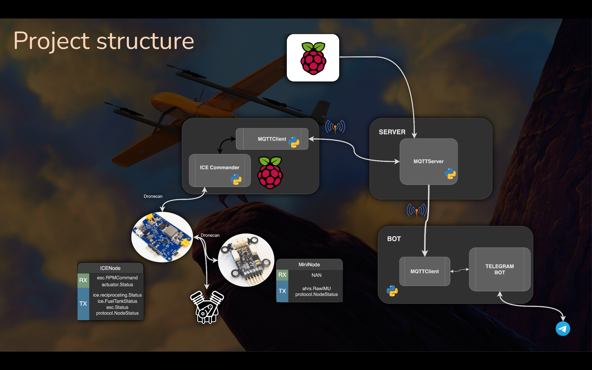

# ice_runner

**ice_runner** is a project designed to control Internal Combustion Engine (ICE) runners using a network of Raspberry Pis and a Telegram bot interface. Each ICE is interfaced through the RaccoonLab Dronecan ice_node. The Raspberry Pi serves as a control unit, funneling commands from a Telegram bot, which can also relay status updates and logs.

## Table of Contents
1. [Requirements](#requirements)
2. [Setup and Configuration](#setup-and-configuration)
3. [Running the Project](#running-the-project)
   - [Quick Start](#quick-start)
   - [Manual Execution](#manual-execution)
4. [Project Structure](#project-structure)
5. [MQTT Communication Diagram](#mqtt-communication-diagram)
6. [Simulator](#simulator)
7. [Testing and Future Enhancements](#testing-and-future-enhancements)
8. [Hints](#hints)

## Requirements
- Raspberry Pi
- Internal Combustion Engine (ICE) Block

## Setup and Configuration

### Environment Configuration
Create a `.env` file with the following parameters:
```
BOT_TOKEN=YOUR_BOT_TOKEN
SERVER_PORT=1883
SERVER_IP=localhost
CHAT_ID=YOUR_CHAT_ID
RUNNER_ID=1
```
- **BOT_TOKEN**: Your Telegram bot token.
- **SERVER_PORT and SERVER_IP**: Used for MQTT communication.
- **CHAT_ID**: The specific chat where the bot is accessible.
- **RUNNER_ID**: The unique identifier for the Raspberry Pi, helpful when managing multiple Pis.

### Installation
Choose one of the following setup methods:

1. **Automated Setup**: 
   ```bash
   ./scripts/setup.sh
   ```
   Installs all necessary packages and creates a python virtual environment in venv folder.

2. **Manual Setup**: 
   ```bash
   sudo apt install mosquitto
   python3 -m venv venv
   source venv/bin/activate
   pip install -r requirements.txt
   ```

## Running the Project

### Quick Start
Launch all components with a system check every minute (default):
```bash
./scripts/start.sh -v venv -i 60 -e .env -l logs
```
- Monitors and restarts server, client, and bot processes when needed. Logs actions via Telegram. Ensure `BOT_TOKEN` and `CHAT_ID` are set in the environment or `.env` file.

### Manual Execution

#### 1. Raspberry Pi ICE Controller
- Install the MQTT broker:
  ```bash
  sudo ./scripts/install_mqtt.sh
  ```
- Update the ICE configuration in `ice_configuration.yml`. You can also modify settings using Telegram commands (`/config`).
- Start the ICE runner:
  ```bash
  ./src/ice_runner/main.py client --id 1 --config ice_configuration.yml
  ```

#### 2. Server
- Follow [this guide](https://www.atlantic.net/dedicated-server-hosting/how-to-install-mosquitto-mqtt-server-on-ubuntu-22-04/) to set up Mosquitto MQTT server.
- To allow anonymous access from other devices, edit `/etc/mosquitto/mosquitto.conf`:
  ```
  allow_anonymous true
  listener 1883 0.0.0.0
  ```
- Start the server script:
  ```bash
  ./src/ice_runner/main.py srv
  ```

#### 3. Bot Start
- Launch the bot script:
  ```bash
  ./src/ice_runner/main.py bot
  ```

## Project Structure
The server acts as the main controller, with independent asynchronous processes for the server and bot, interconnected via the MQTT protocol.

- 

## MQTT Communication Diagram
- Server subscribes to bot and Raspberry Pi topics for coordinated control.
- Bot and Raspberry Pi exchange messages and commands using MQTT.

- 

## Simulator
To simulate ICE using a CAN interface (e.g., slcan/vcan):
```bash
./src/ice_runner/main.py sim --n_tries=3 --log_dir=logs --vcan=can0
```
- `--n_tries`: Number of times the simulation will restart the engine at startup (default: 3).
- `--vcan`: CAN interface to use; defaults to the first available.

## Testing and Future Enhancements
- **To Do:**
  - [ ] Split `ExceedanceTracker` into separate modes.

- **Tests:**
  - [ ] Add tests for the bot.
  - [ ] Add tests for the server.
  - [ ] Extend client tests:
    - Test `NOT_CONNECTED` state after connecting to an external node.

## Hints
For rapid MQTT server configuration, append the following to `/etc/mosquitto/mosquitto.conf`:
```
allow_anonymous true
listener 1883 0.0.0.0
protocol mqtt
```
