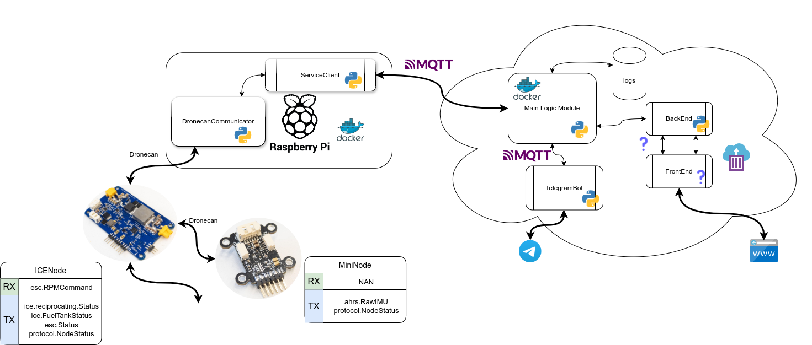

# ice_runner

The project is a contoller for Internal Combustion engines (ICE) runners. Each ICE is connected to RaccoonLab Dronecan ice_node and mini_node. The nodes are connected to RaspberryPi it sends ICE status and listens to commands from specific topic of MQTT server. User may send commands to the Raspberry Pi using Telegram bot.

## Requirements

- Raspberry Pi
- ICE block

## How to run the project 
0. Specify telergam bot token and mqtt server ip in the file `.env`.
1. Raspberry Pi ICE controller installation
    - Install mqtt broker
        ```bash
        sudo apt-get update
        sudo apt-get install mosquitto mosquitto-clients
        ```
    - Install required packages
        ```bash
        pip install -r requirements.txt
        ```
    - Run the script with the specified id for the raspberry pi. This id is used for MQTT communication and in telegram bot commands.
        ```bash
        python raspberry/main.py --id 1
        ```

2. Server installation
Use the [guide](https://www.atlantic.net/dedicated-server-hosting/how-to-install-mosquitto-mqtt-server-on-ubuntu-22-04/) to start your own Mosquitto MQTT server on your machine

    - Install required packages
        ```bash
        pip install -r requirements.txt
        ```
    - Run the script
        ```bash
        python server/main.py
        ```
2.1 Bot start
    - Run the script

        ```bash
        python bot/main.py
        ```

## Project structure
Server is the main controller of the project.
Server and Bot are asynchronous processes and communicate with each other using MQTT protocol. Therefore all parts of the project are independent and connected by MQTT.
    
### MQTT communication diagram
Server subscribes to bot and rp topics and sends commands and statuses to the respective topics with commander suffix.
Bot subscribes to its commander topic and sends user commands to the server.
Raspberry Pi subscribes to its commander topic and sends parsed dronecan messages to the server.
    
